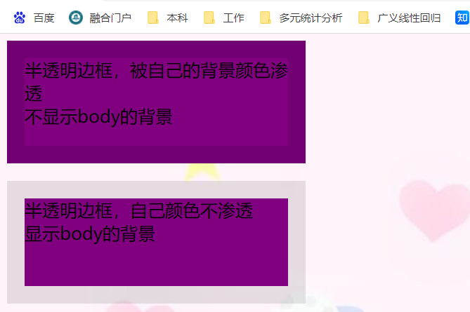
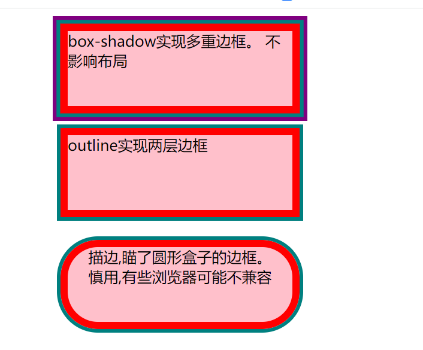
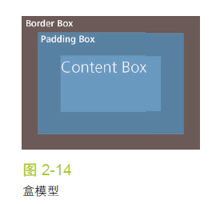
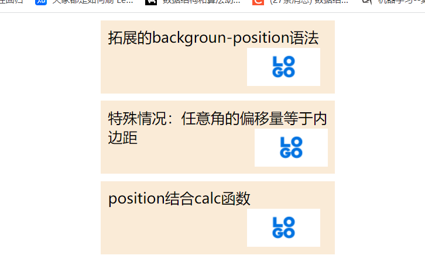

# 2023-02-26-CSS背景与边框

《CSS解密》

第一章 引言 读书笔记

第二章 背景与边框 读书笔记

## 引言

### CSS编码技巧

- 尽量减少代码重复，以减少维护时需要改动的地方。

  - 当某些值相互依赖时，应该把它们的相互关系用代码表示出来。方便后期维护。

    在CSS中，相关性是一个很重要的特性，但是**得想清楚哪些东西是真正相关的**

  - 有时候，**代码量易维护和代码量少不可兼得**

  - currentColor，**CSS有史以来第一个变量**

    自动从文本颜色那里得到颜色

  - **继承**

    inheit关键字

    可以用在任何CSS属性中，总是**绑定到父元素**的计算值。（对于伪元素说，绑定到该伪元素的**宿主元素**）

- 合理使用简写

  如background代替background-color。

  因为元素的背景可能改变，如果设定了color,最后设定为图片，那还要继续修改。而简写包含了更多的情况

  

  **如果<font color=red>只为某个属性提供一个值</font>，那么它就会扩散出来应用到列表的每一项**

  注意：是确定了只有一个值，如背景图片全部no-repeat

### 相信眼睛，而不是数字

- 垂直居中：需要把物体几何中心上移一点，才能获得理想的视觉效果

- 圆形的字体，需要稍微放的大一些，在视觉上才和其他字体差不多大小

- 内边距，给容器四边都指定内边距，但是实际效果并不等。

  如在视觉上，字母的上下内边距比外边距要宽的多。解决：减少上下内边距。

### 响应式网页设计

​	暂时未看


## 背景与边框

### 半透明边框

<font size=4px>**背景知识**</font>

​	CSS中的半透明色属性值：`rgba(),hsla()`

**难题**

​	半透明色应用**主要集中在背景上**。原因：

1. 早期工作者
2. 针对背景的回退方案比其他属性容易的多。
3. （重点）在其他属性，如**边框中使用半透明色并没有那么容易**。

**解决方案**

​	**背景与边框的工作原理**：默认情况下，背景会延伸到边框所在区域的下层。`验证方法:给有背景的元素应用虚线边框。`

​	**解决方法**：

​	CSS3背景与边框的`background-clip`属性调整上述默认行为。

```css
background-clip: border-box;   # 默认值,背景入侵边框
background-clip: padding-box;  # 背景会在内外边距处被截掉,不会入侵边框
```

**示例**



### 多重边框

**背景知识**

​	盒子阴影box-shadow属性的基本用法

```css
box-shadow的5个属性值
x轴偏移量 
y轴偏移量
模糊半径
扩张半径: 指定正值或负值,增加或减小投影面积。 
颜色 
/*注意,可用逗号分隔得到多个shadow*/
```

**难题**

​	CSS没有直接设置多重边框的属性。

**解决方案**

1.box-shadow方案

​	**两个为0的偏移量+0的模糊值+正值的扩张半径**，得到的“投影”就像**一道实线边框**。且，支持**逗号分隔语法，可以创建任意数量的实线投影**，实现多重实线边框的效果。

box-shadow注意事项：

- box-shadow的扩散半径层层叠加，且第一层位于顶层，第二层次之。

  eg：第一层设置10px的边框，还想要视觉效果为5px的第二层边框，代码中需要将第二层设置为15px。

- box-shadow只能实现<font color=red>实线效果</font>。没办法实现虚线。

- 投影不影响布局，不会受到box-sizing属性影响。

  不过，可以通过内外边距模拟边框所需要占据的空间

- 投影“加边框”不会响应鼠标事件，如悬停或点击。

- 投影 添加inset关键字使投影在内圈。

2.outline方案

适用场景：**适用只需要两层边框的情况**。

方法：先设置常规边框border，再加上outline(描边)属性来产生外层边框。

优点：灵活，可以产生虚线；

​			可以通过outline-offset属性设置描边和元素边缘之间的距离。

outline注意事项：

- 只适用双层“边框场景”。因为outline并不能接受逗号分隔多个值
- 描边不一定会贴合`border-radius`属性产生的圆角。
- CSS规范中描述“描边可以不是矩形”，所以慎重使用不是矩形的描边。如果想用，需要在不同的浏览器中测试最终效果。

**示例**



### 灵活的背景定位

**背景知识**

background-position语法

```css
background-position: x坐标 ;     /*此时y坐标默认50%*/
background-position: x坐标 y坐标;
/*坐标参数可以是:百分数或center,top,bottom,right,left等关键字*/
```

**难题**

​	需求：现实中，有时针对容器的某个角对背景图片做偏移定位，如右下角。

​	css2.1中，只能指定距离左上角的偏移量，或者完全对齐到其他角。

- 对于有固定尺寸的容器，可以根据需要到右下角的偏移量，计算出左上角的偏移，实现上述需求。

- 当容器尺寸不固定时，就无法做到需求。

**解决方案**

1.background-position的拓展语法方案

​	CSS3中background-position属性已经得到拓展，<font color=red>它允许指定背景图片**距离任意角的偏移量**</font>，只需要在偏移量前面指定关键字。

​	如，距离右边缘20px,底边10px

```css
background-position: right 20px bottom 10px;
```

​	注意，提供一个合适的回退方案。因为在不支持上述拓展语法的浏览器中，背景图片会紧贴在左上角（**背景图片默认位置**）。提供的回退方案就是把老套的bottom right写在background的简写属性中。

```css
background: url() no-repet bottom right #fff;
background-position: background-position: right 20px bottom 10px;
```

2.background-origin方案

**适用情况**（偏移量较特殊的情况）

​	给背景图片设置距离某个角的偏移量时，有一种常见情况：**偏移量与容器内边距保持一致**。如，采用background-postion的拓展与法方案，代码可能是：

```css
padding: 10px;
background: url() no-reprt #fff;
background-position: right 10px bottom 10px;
```

​	但是，每次改动内边距的值的时，我们都需要在三个地方更新这个值。不够DRY。

​	更简单的方法:**让背景图片自动跟着内边距走,不用另外声明偏移量**

​	<font color=red>background-position: top left;这样的代码，到底是哪个左上角？ 每个元素身上存在三个矩形框，边框的外沿框(border-box)、内边距的外沿框(padding-box)、内容区的外沿框(content-box)。</font>那么，背景定位background-position属性指定的是哪个左上角？



​	**默认情况下，background-position是以padding-box为准的**，这样边框才不会遮住背景图片。

因此，top left指的是padding box的左上角。

​	在CSS3中，**新属性background-origin,可以改变这种行为**。其语法为

```css
background-orgin: 
padding-box 默认参数,内边距外沿对齐
content-box 和内容区外沿对齐
```

**解决方法**

​	此时，若发生改变，就不用再修改多次值。

```css
padding: 10px;
background: url() no-repeat bottom right; 
background-origin: content-box;
```

3.calc()方案

​	仍然以**左上角的偏移量思路**来计算，针对大小不固定的容器，其实就是需要

- 水平偏移量 100% - 20px
- 垂直偏移量 100% - 10px

​	在css中，**calc()**函数允许执行此种运算。

```css
background: url() no-repeat;
backgroud-position : calc(100% - 20px) calc(100% - 10px) ; 
```

**注意**：calc中加减号的两侧需要有空格。

**示例**

