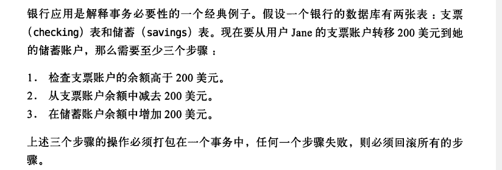
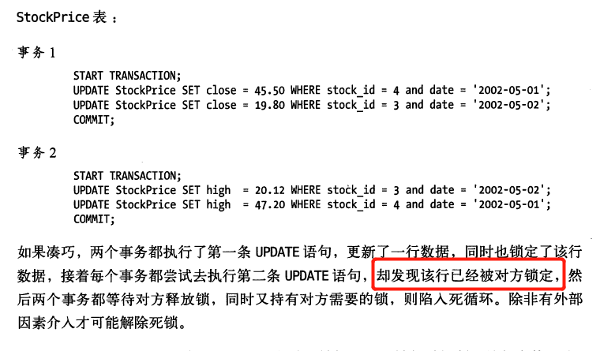
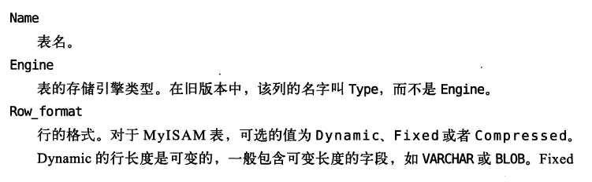
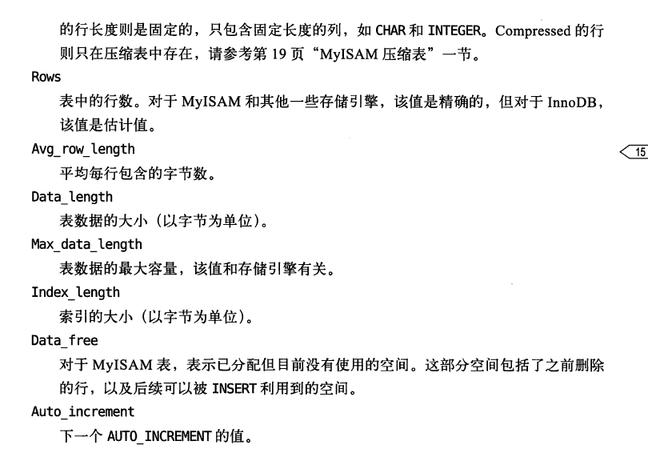
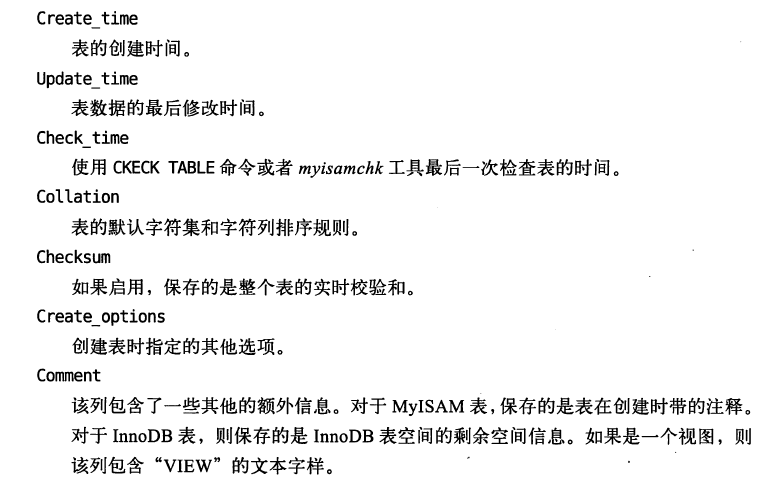

# MySQL架构与历史

​		MySQL最重要、最与众不同的特性：存储引擎架构，这种架构的设计将**查询处理及其他系统任务**和**数据的存储/提取**相分离。这种处理和存取相分离的特性，可以让开发者根据需求选择数据存取方式。

## MySQL逻辑架构


MySQL分为两层：

- Server层：核心服务功能都在这一层；完成跨存储引擎的几乎所有操作；存储所有内置函数；
- 存储引擎层：存取数据

### 连接管理与安全性

​	每个客户端连接都会在服务器进程中拥有一个**线程**，这个连接的查询**只会在这个单独的线程中执行**，该线程只能轮流在某个CPU或CPU核心中运行。服务器会缓存线程。

### 优化与执行

​	MySQL解析器创建解析树后，优化器会进行优化，如：重写查询、决定表的读取顺序、选择合适索引等。

- hint关键词

  提示优化器，影响决策过程

- explain关键字

  优化器解释（explain）优化过程的各个因素，使用户知道服务器如何进行决策优化。便于用户重构查询、修改相关配置。

​	优化器并不关心存储引擎，但是存储引擎对于优化查询有影响。

**SELECT语句执行过程**：

1. 连接器，和客户端建立了连接

2. 查询缓存，命中返回结果。若无，到2

3. 解析器，词法解析、语法解析

4. 优化器，制定决策过程，选择索引

5. 执行器，执行建立的决策

6. 存储引擎：提供读写接口，返回数据集。

## 并发控制

​	只要有多个查询需要在**同一时刻修改数据**，都会发生并发控制的问题。这里讨论MySQL在两个层面的并发控制：

- 服务器层

- 存储引擎层

​	这里只简单讨论MySQL如何控制**并发读写**

### 读写锁

情况：

- 同一时刻，多个用户同时读，没问题。
- 同一时刻，**一个用户读，一个用户改**，有问题。
- 同一时刻，多个用户改，有问题。

解决方法：并发控制。通过两种类型的锁解决问题，**共享锁**（读锁）和**排他锁（写锁）**

读锁：互不干扰，多个用户可以同时读取

写锁：排他，会阻塞其他的读锁和写锁

### 锁粒度

​	提高共享资源并发性的方式：让锁定对象更有选择性。尽量只锁定**需要修改的部分数据**，而不是所有资源。

​	锁也会消耗资源。如果系统花费大量时间来管理锁，而不是存取数据，会影响性能。

​	策略锁，就是在锁的开销和数据安全性之间寻求平衡。MySQL提供了多种选择，每种MySQL**存储引擎都可以实现自己的策略所和锁粒度**。下面介绍两种**重要的锁策略**

1. 表锁 (table lock)

   最基本锁策略、开销最小的策略。控制整个表。

2. 行级锁（row lock）

   行级锁可以**最大程度支持并发处理（同时也带来了最大的锁开销）**。在InnoDB和XtraDB中，实现了行级锁。

   行级锁<font color=red> 只能在存储引擎层实现，而在MySQL服务层没有实现。</font>

## 事务

​	事务就是**一组**原子性的SQL查询，或者说一个独立的工作单元。**事务内的语句，要么全部执行成功，要么全部执行失败。**

​	银行应用是**解释事物必要性的**一个经典例子。



- 事务语法

  ```sql
  start transaction;   -- 开始一个事物
  sql语句1;            -- SQL语句
  sql语句2；
  ...;
  -- 执行成功,COMMIT提交事务,持久保留修改数据
  COMMIT;           
  ```

  事物提交失败，则回滚到事务未进行的状态。

  一个运行良好的事务系统，必须具备ACID。

  - A：原子性

    事务是不可分的最小单元，要么全部执行成功，要么全部失败回滚。不可只执行一部分。

  - C：一致性

    数据库总是从一个一致性的状态转换到另外一个一致性状态。

  - I：隔离性

    通常来说，一个事物所做的修改在**最终提交**以前，对其他事物不可见的。

  - D：持久性

    一旦事务提交，则其所做的修改回永久保存的数据库中。此时，系统崩溃，修改的数据也不会丢失。

​	事务处理需要数据库系统做更多的安全工作，需要更大内存、CPU等。MySQL的存储引擎架构就发挥优势，用户可以根据业务是否需要事务处理，来选择合适的引擎。

### 隔离级别（I 隔离性）

​	SQL标准中定义了4种隔离级别，每一种级别都规定了一个事务中所做的修改，哪些在事务内部和事务间是可见的，哪些是不可见的。较低级别的隔离通常可以执行更高的并发，系统开销也更低。

1. read uncommited(未提交读)

   事务中的修改，即使没有提交，对其他事物也可见。

   问题：脏读，事物可以读取未提交的数据。

   实际中较少使用，安全性差。

2. read commited(提交读)

   解决的问题：

   - 脏读

   一个事物开始时，只能看见已经提交的事物的修改。换句话说，一个事物从开始到提交之前，所做的修改其他事物不可见。

   问题：**不可重复读**。因为两次执行相同的查询，可能会得到不一样的结果。

   大多数数据库的隔离级别都是read commited(但是MySQL不是)。

3. ppepeatable read(可重复读)

   解决的问题：

   - 脏读
   - 不可重复度

   该级别可以保证同一个事务中多次读取同样的记录的结果使用一样的。

   问题：幻读，当某个事物在读取某个范围内的记录时，另外一个事务又在该范围内插入了新的记录。

   **可重复读是MySQL的默认事务隔离级别。**InnoDB和XtraDB存储引擎通过多版本并发控制解决了幻读问题。

4. seralizable(可串行化)

   解决的问题：

   - 脏读
   - 不可重复度
   - 幻读

   这是最高的隔离级别。实际中较少使用，开销大。

### 死锁

​	死锁是指，两个或多个**事务**在同一资源上相互占用，并请求锁定对方占用的资源，从而导致恶性循环的现象。

- 产生死锁的状况
  - 多个事务试图以**<font color=red>不同顺序</font>锁定资源时**，就有可能产生死锁
  - 多个事务**同时锁定一个资源**，也会产生死锁



​	只要事务进行，没有提交结束，遇到的资源就会被锁定。**上述情况中，双方都在等待对方释放锁，同时又持有对方的锁。**

- 解决方法

  数据库系统一共了各种死锁检测和死锁超时机制。

  InnoDB目前处理死锁的方法：将**持有最少行级排他锁的事物进行回滚。**

​	锁的行为和顺序和存储引擎相关。以同样的顺序执行语句，有些存储引擎会产生死锁，有些则不会。死锁的产生有双重原因：

- 有些是因为真正的数据冲突，这种很难避免；
- 有些事因为存储引擎的实现当时导致的。

​	死锁发生后，只有部分或者完全回滚其中一个事物，才能打破死锁。对于事务型的系统，这是无法避免的。

### 事务日志

​	事务日志可以帮助提高事务的效率。使用事务日志，存储引擎在修改表数据时的运作方式：

1. 修改数据内存拷贝

2. 修改行为记录到持久的磁盘上的事务日志中

   事物日志采用追加的方式，写日志的操作是一块连续的I/O，而不是随机I/O，不需要移动多个磁头。

3. 在合适的空闲的时候，内存中北修改的数据在后台慢慢写回磁盘

​	如果修改数据已经完成1,2步骤，但没完成3，此时系统崩溃，存储引擎重启后能够自动回复这部分修改的数据。

### MySQL中的事务

​	MySQL提供了两种事务型的存储引擎：InnoDB,NDB Cluster。还有一些第三方存储引擎也支持事务，如XtraDB,PBXT。

- 自动提交（auto commit）

  MySQL默认采用自动提交模式。如果不是显示的开始一个事务，则每一个查询都被当做一个事务执行提交操作。

  在当前连接中，可以通过设置`autocommit`变量启用或禁用自动提交模式。

- 在事务中混合使用存储引擎

  MySQL服务层不管理事务，事务由下层存储引擎实现。所以在同一个事务中，使用多种存储引擎是不可靠的。

- 隐式和显示锁定

  InnoDB采用的是两阶段锁定协议(two-phase locking protocol)。

  隐式锁定：事务执行的过程中，随时都可以执行锁定，<font color=red>锁只有在执行commit或者rollback的时候才会释放</font>,并且所有的锁都在同一时刻被释放。InnoDB会在根据隔离级别，在需要的时候加锁。

  显示加锁：使用特定的语句

  ```sql
  select ... lock in share mode
  select ... for update
  ```

  MySQL也支持`lock tables`和`unlock tables`语句，这是在服务器层实现的，和存储引擎无关。它们有自己的用途，不能代替事务处理。如果应用到事务，还是要选择事务型存储印象。

## 多版本并发控制(MVCC) 

​	可以认为MVCC是行级锁的一个变种，但是它在很多情况下避免了加锁操作，因此开销更低。大多数的实现机制为：非堵塞的读操作，写操作只锁定必要的行。

​	MVCC的实现，通过保存数据在某个时间点的快照来实现。不同的存储引擎的MVCC实现不同，以InnoDB的简化版行为说明MVCC的工作。

​	

## MySQL存储引擎

​	概要的描述MySQL的存储引擎，而不涉及太多细节。

- 在文件系统中

  - MySQL将每个数据库（可以称之为`schema`）保存为数据目录下的一个子目录。
  - 创建表时，在数据库子目录下，创建一个和表同名的*.frm*文件保存表的定义

  因为MySQL使用文件系统的目录和文件保存数据库和表的定义，大小写是否敏感的具体的操作系统有关。

  不同存储引擎**存取数据的和索引**的方式不同，但是**表的定义是在MySQL服务层**统一处理的。

使用`show table status`命令显示表的相关信息

该的各个参数含义如下：







### InnoDB存储引擎

​	InnoDB是MySQL默认的事务型存储引擎，也是最重要，使用最广泛的存储引擎。它被设计用来处理大量的短期事务，短期事务大部分是正常提交的，很少会被回滚。

​	InnoDB的性能和自动崩溃回复的特性，使得它在非事务型存储的需求中也很流行。除非有特别需求，应该优先考虑使用InnoDB引擎。

- InnoDB存储引擎概览

  - InnoDB的数据存储在表空间中

    - 表空间是由InnoDB管理的一个黑盒子，由一系列数据文件组成。

    - InnoDB可以将每个表的数据和索引存在**单独的文件中**

  - InnoDB采用MVCC来支持高并发

    - 实现了四个标准的隔离级别，**默认级别是可重复读**。

    - 使用间隙锁策略防止幻读的出现

  - InnoDB的表基于**聚簇索引**建立的

    - 聚簇索引对主键查询有很高的性能，不过它的二级索引必须包含主键列。

  - InnoDB内部做了很多优化

### MyISAM存储引擎

​	在MySQL 5.1及之前的版本，MyISAM是默认的存储引擎。MyISAM**不支持事务和行级锁，而且崩溃后无法安全恢复**。对于只读数据、或者表比较小、**可以忍受修复**操作，则依然可以继续使用MyISAM。

#### 存储

​		MyISAM将表存储在两个文件中：数据文件和索引文件，分别以*.MYD*和*.MYI*为拓展名。

#### MyISAM特性

​	MyISAM是MySQL最早的存储引擎之一，有一些特性可以满足用户的实际需求。

- 加锁与并发

  **对整张表加锁，而不是行**。读取时，对所有读到的表加共享锁，写入时，对所有表加排它锁。但是在表有读取查询时，可以向表中插入新的记录（被称为并发插入）

- 修复

  可以手工或者自动执行检查和修复操作，但是这和事务恢复以及崩溃修复是不同的概念。执行表修复可能导致一些数据丢失，而且很慢。

- 索引特性

  支持全文索引、也支持基于前多少字符创建索引。

- 延迟更新索引键

  作用：提高写入性能。

  机理：如果指定了delay_key_write选项，在每次修改执行完成后，不会立刻将修改的索引数据写入磁盘，首先会写到内存缓存区，在清理缓冲区或关闭表的时候才会将对应的索引写入磁盘。

  缺点：崩溃时会造成索引损坏，需要执行修复操作

#### MyISAM压缩表

​	如果表在创建并导入数据后，不会再进行修改操作，那么这样的表适合采用MyISAM压缩表。

​	*myisampack*压缩表。压缩表不能修改（除非先解压、然后修改、再压缩）。

​	压缩表可以极大减少磁盘空间占用，也会减少I/O。

#### MyISAM性能

​		MyISAM最典型的性能问题：表锁。

### MySQL内建的其他存储引擎

​	MySQL还有一些特殊用途的存储引擎。有些可能已经不再支持，有些会继续支持，但是需要明确地启用后才能使用。

- Archive引擎

- Blackhole引擎

- CSV引擎

  csv引擎可以将普通的csv文件作为MySQL的表来处理，但是**这种表不支持索引**。

  复制到MySQL数据目录下，就能在MySQL中打开使用。CSV引擎可以作为一种数据交换的机制，非常有用。

- Federated引擎

- Memory引擎（重要）

  **如果需要快速的访问数据，并且这些数据不会修改，重启以后丢失也没有关系**，那么使用Memory表(以前也叫做HEAP表)是非常有用的。

  Memory表至少比MyISAM表要快一个数量级，**因为所有的数据都保存在内存中，不需要进行磁盘I/O。Memory表的结构在重启以后还会保留，但数据会丢失**。

  Memroy表在很多场景可以发挥好的作用：

  - 用于查找或映射表，
  - 用于缓存周期性聚合数据的结果
  - 保存数据分析中产生的中间数据

  Memory表支持Hash索引，因此查找操作非常快。Memory表是表级锁，因此并发写入性能较低。

  如果MySQL在执行查询的过程中需要使用临时表来保存中间结果，**内部使用的临时表就是Memory表**，如果中间结果太大超出Memory表的限制，则会转换为MyISAM表。

- Merge引擎

- NDB集群引擎

### 第三方存储引擎

#### OLTP类引擎

- XtraDB存储引擎是基于InnoDB引擎的改进版本，可以作为InnoDB的一个玩去哪的替代产品。

- PBXT，和InnoDB非常类似的OLTP类存储引擎
- TokuDB存储引擎，使用一种新的索引数据结构：分形树；它是一种大数据存储引擎。

#### 面向列的存储引擎

​	MySQL默认是面向行的，每一行的数据是一起存储的，服务器的查询也是以行为单位。而在面对大量数据时，面向列的方式可能效率更高。

- Infobright最有名的面向列的存储引擎。
- InfinDB

#### 社区存储引擎

​	社区存储引擎很多，但是大部分影响力有限，或者很少有人使用。

### 选择合适的存储引擎

​	对于如何选择存储引擎，简单归纳为一句话：除非需要用到某些InnoDB不具备的特性，并且没有其他办法可以替代，否则都应该优先选择InnoDB引擎。例如，要使用全文索引，建议优先InnoDB+Spnhinx的组合，而不是使用支持全文索引的MyISAM.

​	除非万不得已，不建议混合使用多种存储引擎。如果应用需要不同的存储引擎，请先考虑一下几个因素。

- 事务

  需要事务支持：InnoDB（XtraDB）

  不需要事务支持，并且主要是select和Insert：MyISAM

- 备份

  需要在线热备份：InnoDB

  定期关闭服务器备份，那么备份的因素可以忽略。

- 崩溃恢复

  MyISAM崩溃后发生损坏的概率比InnoDB高很多，恢复速度也慢。因此，即使不需要事务支持，很多人也选择InnoDB引擎。

- 特有的特性

  如聚簇引擎的优化

  MyISAM支持地理空间搜索

### 转换表的引擎

​	有很多方法可以将表的存储引擎转换成另外一种引擎。

- alter table

  最简单的方法

  ```sql
  alter table t engine = InnoDB;
  ```

  上属语法使用任何存储引擎。问题：需要执行很长时间，因为要复制原表到新表，消耗I/O同时原表可能加锁。在繁忙的表上执行该操作要小心。

  如果转换标的存储引擎，将会失去和原引擎相关的所有特性。如,将一张InnoDB转换为MyISAM,然后再转换InnoDB,原InnoDB表上所有的外键将丢失。

- 导出与导入

  手动的导出导入。

  *mysqldump*工具将数据导出文件，然后修改文件中*crate table*语句的存储引擎选项。同时

  - 修改表名，数据库中不能存在相同表名，即使引擎不同
  - *mysqldump*默认会自动在*creatr table*语句前加上*drop table*语句，不注意这一点可能会导致数据丢失

- 创建与查询(creter和select)

  不需要导出整个表的数据，而是先创建一个新的存储引擎的表，然后利用*inser...select*语法导数据：

  ```sql
  creart table innodb_table like myisam_table;
  alter table innodb_table engine=InnoDB;
  insert into innodb_table select * from myisam_table;
  ```

### 总结

- MySQL拥有分层的架构。

  - 上层：服务器层

  - 下层：存储引擎

    MySQL处理查询时，利用存储引擎和服务层间的API进行交互。

- MySQL最初基于ISAM(MyISAM)构建，病后虚添加了更多的存储引擎和事务支持。

  


