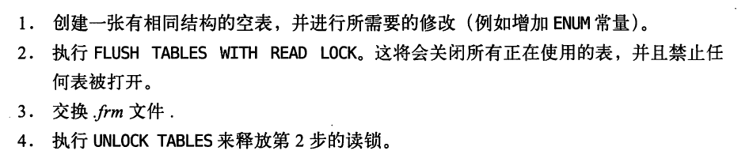

# Schema与数据类型优化

​	《高性能MySQL》第4章 MySQL基准测试读书笔记

​	本章为接下来的两个章节做铺垫。在这三章中，将讨论逻辑设计、物理设计和查询执行，以及它们之间的关系。再阅读完索引和查询优化的章节后，再回来看这一张，会发现本章很有用。

## 选择优化的数据类型

​	下面的几个原则可能有助于选择合适的数据类型。

- 更小的通常更好

  一般情况下，应该尽量使用可以正确存储数据的**最小数据类型**

  但是要确保没有低估需要存储的值的范围，因为增加数据类型的范围一个耗时和痛苦的操作。

- 简单就好

  MySQL内建类型：存储日期和时间，而不是字符串

  整型：存储IP地址

- 尽量避免NULL

  - 通常情况下最好指定列为*NOT NULL*，因为可为NULL是列的**默认属性**。

    如果查询中包含可为*NULL*的列，对MySQL而言更难的优化。**因为可为NULL的列使得索引、索引统计和值比较更复杂**，可为*NULL的列还会占用更多的存储空间*。

    <font color=red>可为NULL的列被索引时，每个索引记录需要一个额外的字节，在MyISAM里甚至还可能导致固定大小的索引变成可变大小的索引。</font>

  - 通常，把可为NULL的列修改为NOT NULL的列带来的性能提升比较下，所以调优时没有必要首先在现有的schema中查找并修改，除非会导致问题。**但是，如果计划在列上建立索引，就应该把尽量避免设计成可为NULL的列**

​	在选择数据类型时，首先选择大数据类型：数字、字符串、时间等。然后选择具体的类型。MySQL可以存储相同类型的数据，只是存储的长度和范围不同、允许的精度不同，**相同大类型的子类型**也有一些特殊的行为和属性。

### 整数类型

​	数字类型：整数和实数。

整数类型：

- tinyint 8位存储空间 
- smallint 16位存储空间
- mediumint 24位存储空间
- int 32位存储空间
- bigint 64位存储空间

各个类型的存储范围是，$-2^{(n-1)}$到$2^{n-1}-1$,其中$n$是存储空间的位数。

整数类型还有可选的unsigned属性，表示不允许负值，**这大致可以使正数的上限提高一倍**。

### 实数类型

- float 
- double 
- dcimal 可以指定小数点前后所允许的最大位数

### 字符串类型

- varchar

  用于存储可变长字符串，是最常见的字符串类型。比定长类型节省空间，它仅使用必要的空间。

  例外情况：MySQL表使用*row_format=fixed*创建的话，每一行的都会定长存储。

  varchar使用1或2个额外字节存储字符串长度：如果列的长度小于等于255字节，则使用1个记录，大于255则使用2个字节记录。

  适用varchar的情况：

  1. 字符串列的最大长度比平均长度大的多
  2. 列的更新很少
  3. 使用了像UTF-8这样复杂的字符集，每个字符都使用不同的字节数进行存储

- char

  定长字符串类型，MySQL根据定义的字符串长度分配足够的空间。

  注意：存储char值时，MySQL4.1及之前会删除**所有的末尾空格**，5.0或更高不会是删除空格。

  使用char的情况：

  - 字符串很短,如密码的MD5

    因为很短，如果采用varchar还会额外占用一个字节

  - 所有值都接近同一个长度

​	数据如何存储取决于存储引擎，并非所有的存储引擎都会按照相同的方式处理定长或变长的字符串。Mermory只支持定长的行，**即使有变长字段也会根据最大长度分配空间**。<font color=red>不过，填充和截取空格的行为在不同的存储引擎是一样的，因为这是在MySQL服务器层处理的</font>

- binary 存储定长二进制字符串

- barbinary 存储变长二进制字符串

  二进制字符串存储的是字节码而不是字符。填充也不一样：MySQL填充binary采用的是*\0*而不是空格，检索时也不会去掉填充值。

- BLOB和TEXT类型

  BLOB和TEXT都是为存储很大的数据而设计的字符串数据类型，分别采用二进制和字符方式存储。

  字符类型家族：tinytext,smalltext,text,mediumtext,longtext

  二进制家族：tinyblob,smallblob,blob,mediumblob,longblob

  与其他类型不同，MySQL把每个BLOB和TEXT值当做一个独立的对象树立。

  排序和其他类型不同：只对每个列最前面的max_sort_length字节而不是整个字符串做排序。

  注意：Memory引擎不支持这两种类型，所以如果查询使用了含这两种类型的列的临时表，将不得不使用MyISAM磁盘临时表，将增大开销。

- 使用枚举（ENUM）代替字符串类型

  有时候可以使用枚举列代替常用的字符串类型。

  枚举列（string1,string2,...,stringn）

  MySQL在内部会将存储值在枚举列中的位置（可进行加减法，后显示数字。直接select显示出原字符串），并在表的.*frm*文件中保存“数字-字符串”的映射关系的查找表。

  注意：表中枚举列的排序是按照内部存储整数的顺序，而不是定义的字符串。

  解决方法:、

  1. 按照需要的顺序来定义枚举列

  2. 在查询中使用field()函数显示地指定排序顺序，但这会导致MySQL无法利用索引消除排序

     

### 日期和时间类型

​	MySQL能存储的最小时间力度为秒（MariaDB支持微秒级别的时间类型），但是MySQL也可以使用微秒级别的粒度进行临时运算。

- datetime

  精确到秒，显示格式为“YYYY-MM-DD HH-MM-SS”，与时区无关。

  消耗8个字节存储

  范围：1001年到9999年

- timestamp

  精确到秒，保存了从1970年1月1日午夜以来的秒数，和UNIX时间戳相同。

  使用4个字节存储。

  范围：1970到2038年

  ```sql
  from_unixtime()  -- 把时间戳转换为日期
  unix_timestamp() -- 把日期转换为时间戳
  ```

### 位数据类型

- bit

  可以使用bit列在一列中存储一个或多个true/false的值。bit(n)代表包含n个**位**的字段。MyISAM将位打包处理，根据位计算需要多少个字节。而InnoDB和Memory只能找一个可以存储但是足够小的整数类型来存放。

  MySQL把bit当成字符串类型而不是数字类型。（会发生如下的类型转换）

  但是，**数字在上下的场景中检索时，结果是将位字符串转换为数字**

  

- set

  如果需要保存很多的trun/false(0/1)值，可以考虑合并这些列到一个*set*数据类型，*它在MySQL内部是以一系列打包的位的集合来表示的**

- 在整数列上进行按位操作

  代替set的方式。

  使用一个整数包装一系列的位。例如，把8个位包装到一个tinyint中，并且按位操作来使用。

  这种方法的好处是:可以不适用alter table改变字段代表的“枚举值”。缺点：查询难写，更难理解。

### 选择标识符

标识符：（主键）标识列用的。最好是整数类型。

### 特殊类型数据

- 低于秒级精度的时间戳；

- IPv4地址，人们经常使用varchar(15)列来存储IP地址，然而，IPv4地址是32位无符号整数，所以应该是用无符号整数存储IP地址。

## 范式和反范式

在范式的数据库中，每个<font color=red>事实数据</font>**会出现并且只出现一次**

在反范式化的数据库中，**信息是冗余的，可能会存储在多个地方**

### 范式优缺点

优点

- 更新操作更快

- 减小或避免数据冗余

- 占用内存小

- 在检索时，更少需要distinct或gruop by语句

  在非范式的结构中，通常要使用distinct或group by才能获得唯一的值

缺点

- 需要关联，代价昂贵
- 还可能使一些聚簇索引失效，而这些列如果再一个表中本可以属于同一个样本

### 反范式的优点和缺点

优点

- 避免关联，所有数据都在一张表中

  如果不需要关联表，则大部分查询最差的情况——即使没有使用索引——是全表扫描。当数据比内存大时，这可能比关联要快很多，因为这样避免了**随机I/O**

  单独的表也能是用更有效的索引策略。

### 混用范式化和反范式化

​	怎么选择最佳的设计？

​	完全的范式化或反范式化schema是实验室才有的东西，真实世界不会这么极端，在显示世界经常会混用。

​	常见的反范式化数据：

- 复制或者缓存，**在不同的表中存储相同的特点列**。（范式化不允许存储相同的列）。在MySQL5.0和更新版本中，可以使用**触发器更新缓存**，这个方案变得简单。

- 出于排序的原因：也会从父表冗余一些数据到字表。	

## 缓存表和汇总表

​	有时提升性能最好的方法是**在同一张表中保存衍生的冗余数据**

​	这两个表并没有标准的定义。

​	缓存表：存储从schema其他表（但是获取速度较慢）获取数据的表。（例如，数据逻辑上是冗余的）

​	汇总表：存储使用group by语句聚合数据的表。(例如，数据逻辑上不是冗余的)


### 物化视图

​	物化视图：预先计算并且存储在磁盘上的表，可以通过各种各样的**粗略的刷新和更新**。

​	MySQL并不原生支持物化视图。开源工具Flexviews可以自己实现物化视图，它由下面的几个功能：

- **变更数据**抓取功能CPC，可以读取服务二进制日志并解析相关行的变更

- 帮助创建和管理视图的定义的**存储过程**

- 可以应用变更到数据库中**物化视图**的工具。

  Flexvies通过**提取对源表的更**改，可以增量地**重新计算**物化视图的内容。**这意味着不需要通过查询原始数据来更新视图。**（哪怕是包含关联或聚合的select语句也可以）

  

### 计数器表

​	应用在表中的计数器，在更新计数器时可能会碰到并发问题。计数器表在Web的应用中很常见。建议创建一张独立的表存储计数器，优点：计数器表小且块；避免查询缓存失效。

- 举一个简单例子。

  假设有一个计数器表，只有一行数据，记录网站的点击次数，网站的每次点击都会导致对计数器的更新操作。

  - 思路分析

    <font color=red>如果只有这一行数据，对于所有想要更新这一行的事务才说，这条记录上都有一个全局互斥的锁，导致这些事务只能串行执行。**想要获得更高的并发更新性能，可以将计数器保存在多行中，每次随机选择一条进行更新**</font>。这样，**如果想获得网站总点击次数，可以只用sum聚合查询**

  - 创建的表

    

  - 更新操作

    

​	<font color=red>启发：表+操作（sum）共同完成了需求，而不是只在表的设计中，</font>

- 常见的需求

  每隔一段时间开始一个新的计数器。例如，每过一天开启一个新的计数器。

  - 表设计

    

  - 生成新的计数器

    此时就不需要预先生成多少行的数据，只需要使用on duplicate key update代替。

    **作用：**ON DUPLICATE KEY UPDATE首先会检查插入的数据主键是否冲突，如果冲突则执行更新操作，如果ON DUPLICATE KEY UPDATE的子句中要更新的值与原来的值都一样，则不更新。如果有一个值与原值不一样，则更新： 

​	如果希望减少表的行数，以免表变得太大，可以写一个周期执行的任务，合并所有结果到0号槽，并删除所有其他的槽。                 


## 加快alter table操作的速度

​	alter table的方法是痛苦的，因为大多数情况下，它都会锁表并且重建整张表。下面展示一些特殊场景可以使用的骇客方法。

​	MySQL执行大部分修改表结构的方法是：用新的结构创建一个空表，从旧表中查出所有数据插入新表，然后删除旧表。这样的操作会花费很长时间。

​	如有要修改默认值，两个操作

- 很慢的

  modify colum

  这个语句进行全表数量的操作

- 比较快的

  alter column

  这个语句会直接修改*.frm*文件而不涉及数据

### 只修改*.frm*文件

​	以下操作有风险，不受官方支持，也没有文档记录。执行之前要首先备份数据1

下面这些操作有可能是不需要重建表的：

- 移除一个列的auto_increment属性
- 增加、移除、更改enum和set常见

​	基本的技术是为想要的表结构创建一个新的*.frm*文件，然后用它替换掉那张已经存在的*.frm*文件，具体操作如下：



### 快速创建MyISAM索引

- 高效地载入数据到MyISAM

  常用的技巧：先禁用索引、载入数据、然后重新启用索引

  原因：构建索引的工作被延迟到数据完全载入以后，会快很多

  遗憾：对唯一索引无效

- 处理唯一索引的方法

  

  

## 总结

​	尽可能保持任何东西小而简单总是好的，一些设计、使用schema原则如下：

- 避免过度设计
- 使用小而简单的数据类型
- 使用相同的数据类型存储相似或相关的值，尤其是要在关联条件中使用的列
- 注意可变长字符串。**其在临时表和排序时，可能导致悲观的按最大长度分配内存。
- 尽量使用整型定义标识列
- 避免使用MySQL已经遗弃的特性。
- 小心使用emu和set。最好避免使用bit

​	范式是好的，但是反范式优势也去必须的，有时能带来极大的好处。**预先计算、缓存或生成汇总表可能获得很大的好处，**

