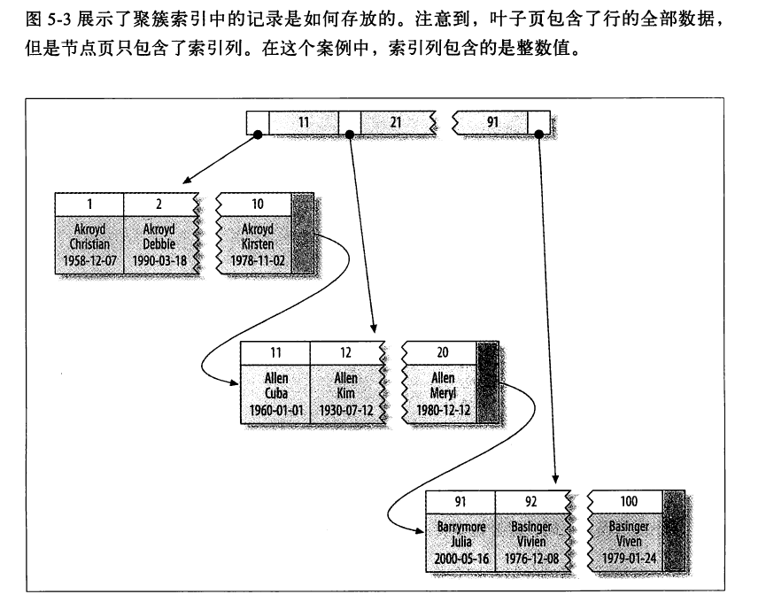
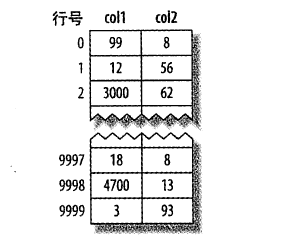
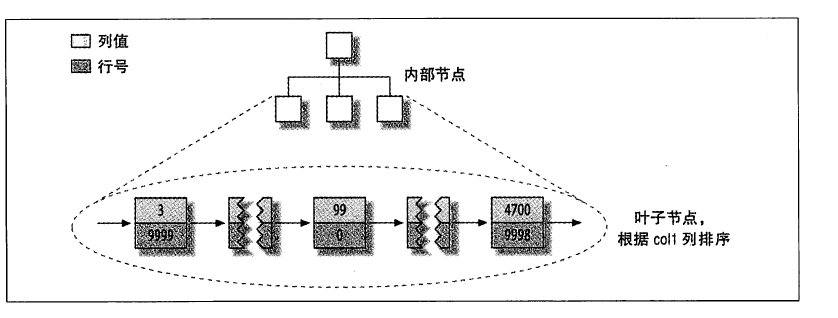
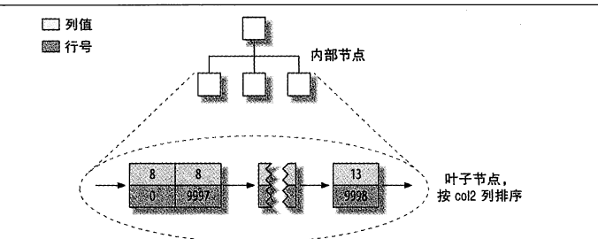
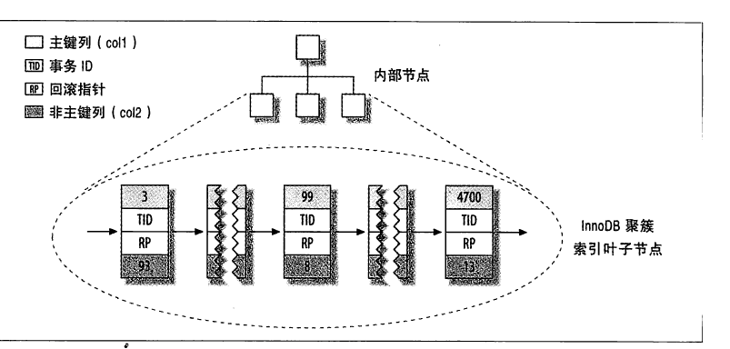
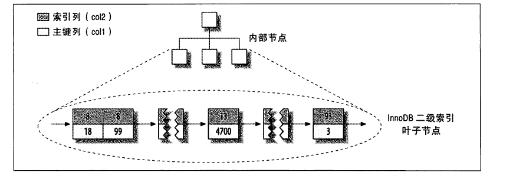
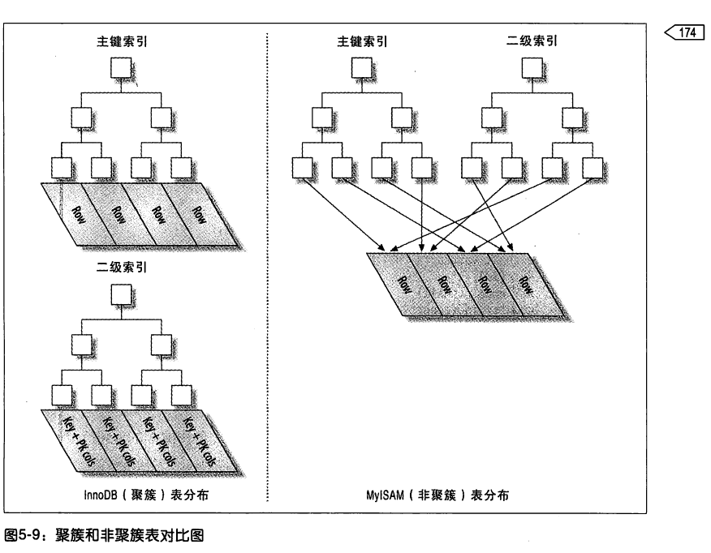
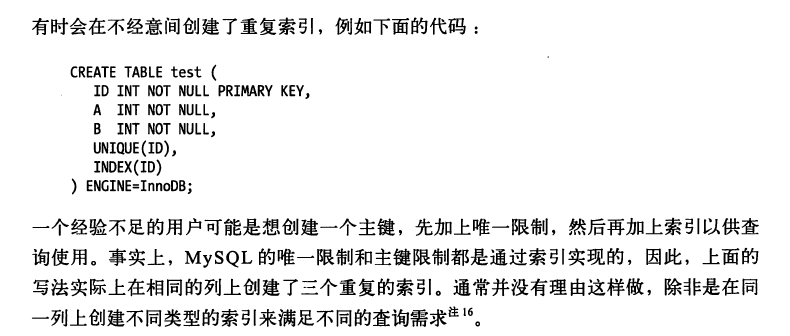

# 创建高性能索引

​	《高性能MySQL》第5章创建高性能索引读书笔记	

​	索引（在MySQL中也称为键,key）是存储引擎快速找到某行值的一种数据结构。这是索引的基本功能。索引优化应该是查询性能优化的最有效的手段。索引能够轻易将查询性能提高几个数量级，创建一个真正最优的索引经常需要重写查询。本章和下一章密切相关。

https://baijiahao.baidu.com/s?id=1710034439941187868&wfr=spider&for=pc  

[讲索引基础知识通俗易懂的网页链接](https://baijiahao.baidu.com/s?id=1710034439941187868&wfr=spider&for=pc)


## 索引基础

​	索引基本流程：MySQL存储引擎在索引中找到对应的值，然后根据索引记录找到对应的数据行。

​	索引可以包含**一个或多个列的值**。多列索引中，列的顺序很重要，因为MySQL只能高效地使用**多列索引的最左前缀**。创建一个包含两列的索引、和创建两个只包含一列的索引，是非常不同的。

### 索引的类型

​	索引是在存储引擎而不是服务层实现的。所以，没有统一的索引标准：不同存储引擎的**索引工作方式**并不一样，也不是所有存储引擎**都支持**所有类型的索引。即使是存储引擎支持了相同的索引类型，底层的实现也可能不同，

#### B-Tree索引

​	如果没有指明类型，那么提到的索引一般都是B-Tree索引，它使用B-Tree数据结构存储数据。大多数MySQL引擎都支持这种索引类型，Archive是一个例外。

​	存储引擎以不同的方式使用B-Tree索引，性能也不同：

- MyISAM使用**前缀压缩技术**使得索引变小，通过**数据的物理位置**引用被索引的行
- InnoDBy按照**原数据格式存储**，通过**主键**引用被索引的行

​    B-Tree通常意味着**所有的值都是<font color=red>按顺序存储的</font>，并且每个叶子页到根的距离相同。**下图大致反应了InnoDB索引的工作方式。

​	根节点：一个B树索引只有一个根节点，位于树的最顶端。（其实是最顶端的分支节点）

​	分支节点：包含的条目 指向索引里其他的分支节点或者叶子节点

​	叶子结点：包含的条目 指向表里的数据行

​	用下面的图来描述B-Tree的结构。


 1. 关于分支节点

    - 分支节点的索引条目按排列

    - 每个索引条目(也可以叫做记录）具有两个字段：数据+指针

      数据：当前分支节点块下面所链接的索引块中**所包含的最小键值**（如果下面链接了多个索引块，会存储每个块的最小键值）

      指针：四个字节，表示所链接的索引块的地址

    - 一个分支节点所能容纳的记录行数由**数据块大小和索引键值的长度决定**

      在上图中，跟节点块包含三条记录，分别指向三个不同的分支节点块。前面的数字代表这三个分支结点所**链接的键值的最小值**，后面的字母+数字代表分支结点的地址。

 2. 关于叶子结点

    - B树索引的所有叶子块一定位于同一层上，B树的数据结构定义的。

    - 叶子结点包含的索引条目按照顺序排列

    - 每个索引条目（也可以叫做记录）具有两个字段：数据+指针。

      数据：索引的键值

      指针：键值对应的记录行的ROWID物理地址。（这里不同存储引擎不一样）

      叶子结点其实是一个双向链表。

      每个叶子结点包含一个指向上和指向下叶子点的指针， **这样在一定范围内便利索引。**

    - 叶子节点指向被索引的数据，而不指向其他节点页。

      


​	B-Tree能够加快访问数据的速度，是因为<font color=red>不需要进行全表扫描来火炬需要的数据，而是从索引的根节点开始搜索</font>。通过比较节点页链接的值和要查找的值找到合适的指针进入下层子节点，最终找到对应的值，或者记录不存在。

​	B-Tree按照顺序存储，非常适合<font colo=red>范围查找数据</font>

**可以使用B-Tree索引的查询类型**。B-Tree索引适用于全键值、键值范围或键前缀查找。其中前缀只适用于最左前缀。

1. 全值匹配

   （多值）索引，和索引中所有的列进行匹配。

2. 匹配最左前缀

   多值索引，使用最左的索隐裂

3. 匹配**列**前缀

   只匹配存在索引的列值开头的部分。

4. 匹配范围值

5. 精确匹配某一列并范围匹配另外一列

   顺序重要，先精确查找再范围查找。

6. 只访问索引的查询

   B-Tree支持查询只访问索引，而无须访问数据行。

​	因为索引树中的节点是有序的，所以除了查找，**索引还可用于查询中的`order by`操作**。如果order by子句满足前面列的几重查询类型，那么这个索引**就可以用来排序**。

​	关于B-Tree索引的限制：

1. 如果不按照索引的最左列开始查找，则无法使用索引。

2. 不能跳过索引中的列。

   多值索引，如三列的多值索引，限制第一个和第三个来查询，跳过第二个，那么索引将只适用第一列的。只有指定了第二列，第三列索引才会生效。

3. 如果查询中有某个列的范围查询，**则其<font color=red>右边的所有列</font>都无法使用索引优化查找**

   like、between都是范围条件。

   解决方法：如果查询列值的数量有限，可以通过使用多个等于条件代替范围条件。

​    <font color=red>索引列的顺序非常重要</font>。在优化性能的时候，可以使用相同列但顺序不同的索引来满足不同类型的查询需求。

​	也有些限制不是B-Tree本身导致的，而是MySQL优化器和存储引擎使用索引的方式导致的，这些限制可能在未来的版本中可能就不再限制了。

#### 哈希索引

##### 哈希索引介绍

​	哈希索引(hash index)基于哈希表实现，<font color=red>只有精确匹配**索引所有列**的查询才有效</font>。

​	对于每一行数据，存储引擎都会对**所有的索引列**计算出一个哈希码(hash code)(`所有的索引列计算得到一个哈希值`),哈希码是一个较小的值，并且不同键值的行计算出来的哈希码也不一样。哈希索引将所有的哈希码存储在索引中，同时存储每个行的指针。

​	在MySQL中，只有Memory支持哈希索引。这也是Memory引擎表的默认索引类型，Memory同时也支持B-Tree索引。<font color=red>值得一提的是，Memory引擎支持非唯一哈希索引（计算出的哈希码可以相同），比较特别</font>。如果多个列的哈希值相同，索引会以链表的方式存放多个记录到同一个哈希条目中。

​	hash索引只需存储哈希值和对应的指针，所以索引的结构十分紧凑，查找速度很快。然后，哈希也有限制：

1. 哈希索引只包含**索引的hash值**和**行指针**，不包含行，所以使用哈希索引不能避免读取行。不过访问内存的行的速度很快，所以这个对性能给的影响不大。

2. 哈希索引数据不是按照索引值的数据存储的，**无法用于排序**

3. 哈希索引也不支持**部分列匹配查找**，因为是哈希是使用索引的全部列计算得到的哈希值。使用最左前缀也不可以。

4. **哈希索引只支持等值比较查询,不支持任何范围查询**,

   等值查询包括

   ```sql
   =
   in()
   <==>
   ```

5. 访问哈希索引的数据非常快，除非有很多哈希冲突（不同的索引列值却有相同的哈希值）。当出现哈希冲突的时候，存储引擎必须遍历**链表中的所有行指针，逐行比较，直到找到符合条件的行**

6. 哈希冲突很多，维护的代价会变大。

   更新、删除后面都要遍历链表中的每一行。

​	**由于这些限制，哈希索引只适用于某些特定的场合**，而一旦适应哈希索引，他的性能提升非常显著。举个例子，数据仓库中的星型，就适合哈希。

​	除Memory引擎外，NDB集群引擎**也支持唯一哈希索引**。

​	InnoDB引擎有个特殊的功能叫“**自适应哈希索引**”。当InnoDB注意到某些索引值被使用的很频繁时，它会在内存中基于B-Tree索引之上再创建一个哈希索引，这就让B-Tree也具有了哈希索引的一些优点，比如快速哈希查找。**这是完全自动的、内部行为，用户无法或配置，不过可以关闭。**

##### 创建自定义哈希索引

​	如果存储引擎不支持哈希索引，可以模拟手动创建哈希索引，以享受哈希存储的遍历。思路：在B-Tree基础上创建一个伪哈希索引，这和真正的哈斯索引不同，但是它是使用哈希值而不是键本身进行索引查找。简单来说，就是用原来的键手动生成哈希值。

#### 空间数据索引(R-Tree)

​	MyISAM表支持空间索引，可以存储地理数据。必须使用MySQL的GIS相关函数维护数据。GIS支持并不完善，所以大部分人都不会使用这个特性。

#### 全文索引

​	全文索引是一种特殊类型的索引，**它查找文本中的关键词，而不是直接比较索引中的值。**全文索引和其他索引完全不一样，有很多细节，如停用词、词干和复数、布尔搜索等。**全文索引更类似于搜索引擎做的事情，而不是简单的where条件匹配**

​	在相同的列上同时创建全文索引和基于值的B-Tree索引不会有冲突，全文索引适用于`match against`操作，而不是普通的条件操作。会在第7章讨论更多的全文索引。

#### 其他类型索引

​	还有很多第三方的存储引擎使用不同类型的数据结构存储索引。

## 索引的优点

​	索引可以让服务器快速地定位到表的指定位置。但这不是唯一作用，根据索引的不同数据结构，还可以进行其他附加作用。

​	最常见的B-Tree索引，按照顺序存储数据，还可以做order by和group by操作。且查询中存储了实际的列值，所以某些查询只需要使用索引就能完成全部查询，总结索引有三个优点：

1. 大大减少服务器需要扫描的数据量。
2. 帮助服务器避免排序和临时表。
3. 索引可以将随机I/O变成顺序I/O。

思考：索引是最好的解决方案吗?

**总的来说，只有当索引帮助存储引擎快速查找到记录的好处大于其带来的额外工作的时候，索引才是有效的**。对于非常小的表，大部分情况下，全表扫描更高效。对于特大型的表，需要一种技术直接区分出查询需要的一组数据，而不是一条一条的匹配，例如可以使用分区技术。

## 高性能的索引策略

​	**正确地创建和使用索引**是实现高性能查询的基础。

### 独立的列

​	有一些查询不当使用索引、或不使用已有索引。 

​	如果查询的列不独立，那么MySQL就不会使用索引。独立的列”是指索引列不能是表达式的一部分，也不能是函数的参数。建议：养成简化where条件的习惯，**使用将索引列单独放在比较符号的一列**。

​	错误写法

```sql
-- 肉眼就能看出t=4,写成下面的表达式MySQL无法使用索引
select id form t where t+1=5;
-- 计算可以得出，date_col应该位于什么区间,但是却写成了复杂的公式
select ... where to_days(current_date) - to_days(date_col)<=10;
```

### 前缀索引和索引选择性

​	有时候**索引很长的字符列**，会让索引变得大而且慢。解决方法：

1. 模拟哈希索引

2. 索引从开始的部分字符（推荐）

   - 可以大大解决节约检索空间，提高检索效率，但是会降低索引的选择性。

   ​                                              索引的选择性：$\frac{不重复的索引值(基数)}{数据表记录综述\#T}$

   - 范围[0,1]，越高则代表查询效率越高，选择性高的索引可以让MySQL在查询的时候过滤掉更多的行。

   -  唯一索引的选择性是1，最好的索引选择性，性能也最好。

​    一般情况下，某个列前缀的选择性也足够高，足以满足查询性能。<font color=red>BLOB、TEXT、VARCHAR类型的列，必须使用前缀索引</font>,因为MySQL不允许索引这些列的完整长度。

​	**本节要研究的问题是，应该选择多少长度前缀才能满足较高的选择性，同时索引又不太长?**

​	目标：前缀索引的选择性应该接近于整个列的索引，换句话说，前缀的基数应该接近完整列的基数。

方法1：**为了决定前缀的长度，需要查询统计该列最常见的值，然后和前缀列最常见的值进行比较。**（group+count计算），步骤如下：

1. 统计索引列每个值的出现次数。grrop+count

2. 首先从较小的前缀长度开始，统计该前缀长度下每个值出现的次数。

3. 和整个列进行比较。

   - 如果每个前缀出现的次数和索引整个列的次数差不多，结束

   - 如果前缀出现的次数明显多，则代表唯一前缀比原来的整个列少很多。

     需要增加前缀长度，重复2-3

方法2：计算完整列的选择性，再计算不同前缀的选择性，进行比较。

```sql
-- 计算完整列的选择性
select count(distinct 索引字段列)/count(*) from t;
-- 计算前缀列的选择性
select count(distinct left(索引列,3))/count(*) ,
	  count(distinct left(索引列,4))/count(*) ,
	   ...
	  count(distinct left(索引列,n))/count(*) ,
from t
```

​	  上述方法可通过两个select直接计算得到想要的结果，而不需要再肉眼一次次对比。

​	  前缀索引是一种能使索引更小、更快的方法，但是也有缺点：**MySQL无法使用前缀索引做order by 和group by，也无法使用前缀索引做覆盖扫描。**

​	<font color=red>一个常见的场景是针对很长的十六进制唯一ID使用前缀索引<font>，此时如果采用**长度为8的前缀索引通常能显著提升性能，并且这种方法对生成应用完全透明**。

### 多列索引

​	很多人对多列索引的理解并不够。**常见的错误是**：为每个列单独创建索引、按照错误的顺序创建多列索引。本节讨论第一个错误，第二个错误见下一节。

​	大部分情况下，**在多个列上建立独立的单列索引并不能提高MySQL的查询性能**。MySQL5.0和更新版本引入“索引合并(index merge)”策略，**一定程度上可以使用表上的多个单列索引来定位指定的行**。

​	在下面的select语句中，where后的没个列都有索引。

​	

​	MySQL5.0和更新的版本中，查询能够同时使用这两个单列索引进行扫描，并将结果进行合并，称之为**索引合并策略**，算法有三个变种：or条件的联合，and条件的交叉，两种组合。

​	索引合并策略是一种优化的结果，**但实际上更多时候说明了索引建的很糟糕**：

- 当出现服务器对多个索引做相交操作时（通常由多个and条件），意味着需要一个**包含相关列的多列索引**

- 当服务需要对多个索引做联合操作时（通常有多个or条件），通常需要耗费大量CPU和内存资源在算法的缓存、排序和合并操作上。

  更重要的是，优化器不会把这些操作计算到“查询成本”中，优化器只关心随机页面读取。这会使得查询成本被低估，有可能该执行计划还不如直接走全表扫描。

如果再explain中的extra看到有索引合并，`union或inseraction`

- **应该好好检查一下查询语句和表结构**，看看是不是已经是最优的
- 通过参数optimizer_switch关闭索引合并功能
- 使用ignore index让优化器忽略掉某些索引

### 选择合适的索引列顺序

​	正确的顺序依赖使用该索引的查询，并且同时考虑如何满足**排序和分组的需要**。本节讨论的是B-Tree索引。

​	如何选择索引的列顺序：

- **出于平均性能的考虑，将选择性最高的列放到索引最前列**

  当不考虑排序和分组时十分有用，这时候索引只用于优化where条件的查找。

- **让频率最高的查询，获得最好的性能**，修改索引列的顺序

  索引性能除了与索引列的选择性（整体基数）有关，还与值的分布、查询具体的值需要有关。有时候，在给定了某一具体值的查询时，出于平均性能考虑的索引可能效果很差、甚至摧毁整个性能。

  **因此，可以根据那些<font color=red>运行频率最高的查询来调整索引的顺序</font>，让这种情况下索引的选择性更高**。简单来说，保证最常用的查询效果最好。

  如果没办法提取频率最高的查询、或者运行最差的查询，那么按照经验法则指定索引是非常高效的。

### 聚簇索引

#### 聚簇索引相关概念

​	聚簇索引并不是一**种单独的索引类型**，而是一种数据存储方式。实现依赖于存储引擎，在InnoDB的聚簇索引实际上**在同一个结构中保存了B-Tree索引和数据行。**因为索引由存储引擎负责实现，并不是所有引擎都支持聚簇索引。	

​	当表上有聚簇索引时，数据上**实际上存储在索引的叶子页中**（InnoDB的索引和数据存放在一个表空间中）。术语“聚簇”表示数据行和相邻的键值仅仅地存储在一起。**因为数据行只能存储在一个地方，所以一个表只能有一个聚簇索引（覆盖索引可以模拟多个聚簇索引的情况）**。



- 分支节点只包含索引列的值，这里存储的整数
- 叶子节点存储了全部的值

​	InnoDB通过主键聚集数据，图5-3的“被索引的列”是主键列。如果没有定义主键列，InnoDB会选择一个唯一的非空索引代替。如果没有这样的索引，InnoDB会隐式定义**一个主键**来作为聚簇索引。InnoDB只聚集在同一个页面中记录。包含相邻键值的页面也能会相聚甚远。

​	聚簇主键可能对性能有帮助，但是也会导致严重的问题，所以需要仔细考虑聚簇索引。尤其是将表的存储引擎从InnoDB改成其他引擎的时候（反过来也是）。

​	聚簇数据优点：

- 把相关数据保存在一起，减少I/O
- 数据访问速度更快。将索引和数据保存在同一个B-Tree中，聚簇索引中获取速度比非聚簇更快
- 覆盖索引扫描的查询可以直接使用叶节点中的主键值

​	聚簇的缺点：

- 聚簇数据最大限度提高了I/O密集型应用的性能，但是如果数据全存放在内存中，那么访问的顺序也不重要了，聚簇没优势

- 插入速度严重依赖于插入顺序

  按照主键的顺序插入是最快的；如果不按顺序，加载后最好使用optimize table重新组织一下表。

- 更新聚簇索引列的代价很高，因为会强制InnoDB将每个被更新的行移动到新的位置

- 插入新行，可能面临页分裂的问题

- 扫描全表扫描变慢

- 二级索引可能比想象的要更大，因为二级索引的叶子结点包含了引用行的主键列。

- 二级索引访问需要两次索引查找，而不是一次。

  

#### InnoDB和MyISAM数据分布对比

​	InnoDB聚簇索引，MyISAM非聚簇索引。二者的数据分布、主键索引、二级索引的数据分布有区别。

​	以下面的表为例，比较这两个存储引擎如何存储表

```sql
CREATE TABLE layout_test(
	clo1 int NOT NULL,
    clo2 int NOT NULL,
    PRIMARY KEY(clo1),
    KEY(clo2)
);
-- 假设该表主键clo1取值1~10000,clo2取值1~100,随机顺序插入并使用OPTIMIZE TABLE优化
-- 列col2有很多重复的值
```

- MyISAM

  MyISAM按照数据的插入顺序存储在磁盘上。

  

  左边的数字是行号。

  - 在主键上创建索引的图如下。

    叶子结点：数据部分存储主键的值，指针存储行号。

    索引值按照顺序存储排放。

    

  - 在col2列上创建索引

    索引和主键的索引相同。

    叶子结点：数据存储数值，指针存储数据的行号。数据按照顺序大小排列。

    

  

- InnoDB

  因为InnoDB支持聚簇索引，所以使用非常不同的方式存储数据。下图中显示了整个表，**而不是只有索引**。因为在InnoDB中，聚簇索引“就是”表，所以不需要MyISAM中那样独立的行存储。

  聚簇索引中每一个叶子节点包含了：主键值、事务ID、用于事务和MVCC的回滚指针、**以及所有剩余的列（在这里是col2）**。

  

​		InnoDB的二级索引和聚簇索引很不相同。InnoDB二级索引的叶子节点的**指针部分**不是**行指针，而是主键值，并以此作为指向行的<font color=red>“指针”</font>**。使用主键值当索引会让二级索引占用更多的空间，换来的好处是，InnoDB在移动行时无需更新二级索引中的这个“指针”。

​	下图是InnoDB引擎的col2索引示例。每一个叶子节点数据部分：索引列，指针部分:<font color=red>主键值</font>。



​	下图是对比图。



- key：索引值 
- PK cols：主键值

#### 在InnoDB表中按主键顺序插入行

​	如果正在使用的InnoDB表没有什么数据需要聚集，那么可以定义一个代理键作为主键，**这种主键的数据应该和应用无关，最简单的方式是使用AUTO_INCREMENT自增列**。可以保证数据行按顺序列入，对主键做关联操作的性能也会更好。最好不用随机的（不连续且分布范围非常大）聚簇索引，特别是对I/O密集型的应用。	

- UID作为聚簇索引性能特别差。使用UUID每次插入的未必是最大的，需要做很多额外的工作找到合适的工具。
- 如自增的索引，那么每次插入都会插入到最后一页，性能很好。

总结：使用InnoDB时，应该尽可能按**主键顺序**插入数据，并尽可能使用**单调增加的聚簇键的值**来插入新行。

补充：顺序的主键什么时候会造成更坏的结果？

对于高并发工作负载，按主键顺序插入可能会造成明显的争用。

- 主键的上界会成为热点，因为所有的插入都发生在这里。

- 另一个热点会auto_increment锁机制，遇到这个问题，可能需要重新设计表或者应用，或更改innodb_autoinc_lock_mode配置。

### 覆盖索引

​	通常人们根据查询的WHERE条件来创建合适的索引，这只是其中索引优化的一个方面。设计优化的索引应该考虑到整个查询，而不单单是WHERE条件部分。

​	索引确实是高效查找方式，**但是MySQL也可以使用索引来直接获取列的数据**，这样不必要再读取数据行。<font color=red>如果一个索引的叶子结点已经包含要查询的数据，那么还有什么必要再回表查询呢？如果一个索引包含（覆盖）所有需要**查询的字段的值**，我们就成为覆盖索引。</font>注意，这里不只是WHERE后的字段，而是整个SELECT语句的全部字段。

​	覆盖索引非常有用，能极大提升性能。覆盖索引的好处：

1. 索引条目通常小于数据行大小，如果只读取索引，MySQL会极大减少数据访问量。

2. 索引是按值排序的，对于I/O密集型的范围查询会比随机从磁盘读取每一行数据的I/O要少的多。

3. 一些存储引擎如MyISAM在内存中**只缓存索引，数据就会依赖操作系统来缓存**，会导致严重的性能问题。

4. 对于InnoDB聚簇索引，覆盖索引对InnoDB表特别有用。InnoDB的二级索引在叶子节点中保存了行的主键值，所以如果二级索引能够覆盖查询，则可以避免对主键索引的二次查询。

   在所有这些场景中，**在索引中满足查询的成本一般比查询行要小得多**。

​	覆盖索引必须要**存储索引列的值**，而哈希索引、空间索引和全文索引等都不存储索引列的值。

当发起一个覆盖索引的查询时，在EXPLAIN的Extra列可以看到“`Using index`”的信息。

### 使用索引扫描来做排序

​	MySQL有两种方式可以生成有序的结果:

1. 排序操作
2. 按索引顺序扫描

​	如果EXPLAIN出来的type列的值为“index”，则说明MySQL使用索引扫描来做排序（不要和Extra列的“Using index”搞混淆了）

​	扫描索引本身很快，因为只需要从一条索引记录移动到紧接着的下一条记录。但如果索引不能覆盖查询所需的全部列，**那么就不得不每扫描一条索引就都回表查询一次对应的行**。<font color=red>这基本上都是随机I/O,因为按索引**顺序读取数据的速度**通常比**顺序地读取全表**扫描慢，尤其是在I/O密集型的工作负载时。</font>

​	MySQL的索引既可以用来排序，又可以用来查找（可以同时）。因此，最好的结果是，设计同时满足这两项任务的索引。

索引扫描的使用要求：

- 索引的列顺序和ORDER BY子句的顺序完全一致

- 所有列的排序方向都一样，要么全升、要么全降

- 如果查询关联多表，ORDER BY子句的引用字段全部是第一个表的

- 需要满足索引的最左前缀要求

  以下情况可以不满足最左前缀要求：前导列为常量。

  在WHERE和JOIN中，前导列设置了=谁，只有一个值，变成了常量。

### 压缩（前缀压缩）索引

​		MyISAM使用前缀压缩减少索引的大小，从而让更多索引放进内存。压缩默认只压缩字符串，但通过参数设置也可以压缩整数。

​	CPU密集型应用，压缩会使得查询变慢。

​	I/O密集型应用，某些查询带来的好处较大。

### 冗余和重复索引

​	MySQL允许在相同列上创建多个索引。

​	重复索引：在相同列上，按照相同的顺序创建相同类型的索引。应该避免。



​	

​	冗余索引：如果有索引（A,B），在创建索引A，那么A是荣誉索引，因为(A,B)可以当做A来使用。


找出冗余索引和重复索引的方法：

1. 查询INFORMATION_SCHEMA表
2. Shlomi Noach的*common_schema*中的一些视图来定位
3. Percona Toolkit中的*pt-duplicate-key-checker*工具


### 未使用索引

​	服务器完全用不到的索引，累赘，建议删除。查找未使用索引的方法：

- 
- 

### 索引和锁

​	索引可以让查询锁定更少的行。如果查询从不访问那些不需要的行，那么就会锁定更少的行。

​	InnoDB 只有在访问行的时候才会对其加锁，而索引能够减少InnoDB 访问的行数，从而减少锁的数量。

​	但这只有当InnoDB 在存储引擎层能够过滤掉所有不需要的行时才有效。如果索引无法过滤掉无效的行，那么在InnoDB 检索到数据并返回给服务器层以后，MySQL服务器才能应用WHERE子句。这时已经无法避免锁定行了:InnoDB 已经锁住了这些行，到适当的时候才释放。

​	在MySQL 5.1和更新的版本中，InnoDB 可以在服务器端过滤掉行后就释放锁，但是在早期的 MySQL版本中，InnoDB 只有在事务提交后才能释放锁。

​		InnoDB、索引和锁的少有人知道的细节：InnoDB在二级索引上使用共享锁，但访问主键索引需要排它锁。这消除了使用覆盖索引的可能性，并且使用SELECT FOR UPDATE比LOCK IN SHARPE MODE或非锁定查询要慢很多。

## 索引案例学习（未看）


诀窍：建立索引时,where查询对索引的最左前缀没有限制,那有没有方法使用建立的多值索引呢？

```sql
-- 由于经常用sex列,所以把sex列作为多列索引的第一个左前缀
-- 此次查询对sex列的值没要求,若想使用建立的索引
-- 方法: 通过in列表的方式写出sex索引的所有值 (值列表较短时非常好用,较长不建议)
sex in(“f”,”m”) and 索引2条件 ... and 索引n条件
```


## 维护索引和表

​	维护表有三个主要目的：找到并修复损坏的表；维护准确的索引统计信息；减少碎片。

### 找到并修复损坏的表

​	MyISAM引擎表损坏通常是**系统崩溃**导致的。其他的引擎也会由于硬件问题、MySQL本身的缺陷、操作系统的问题导致索引损坏。

- 损坏的索引及其解决办法

​	损坏的索引会**导致查询返回错误的结果或者莫须有的主键冲突，严重会导致数据库崩溃**。如果你遇到了奇怪的问题，可以尝试运行CHECK TABLE来检查是否发生了表损坏（。CHECK TABLE通常能够找出**大多数表和索引的错误**。

```sql
CHECK TABLE; -- 找出表问题,有些存储引擎可能不支持该命令
REPAIR TABLE;-- 修复损坏的表,有些存储引擎可能不支持该命令
```

```sql
-- 如果不支持上述修复操作,可以通过一个不作任何操作的ALTER操作来重建表
-- 如,修改表的存储引擎为当前的引擎
ALTER TABLE innodb_tbl ENGINE=INNODB;
```

此外，还可以使用存储引擎的一些相关离线工具,如*myisamchk*；或将数据导出一份，再重新导入。

- 损坏的表、表行区域及其解决办法

  ​	如果损坏的是系统区域、或者是表的行数据区域，而不是索引，上面方法无效。

  - 解决办法
    - 从备份中恢复表
    - 尝试从损坏的数据文件中尽可能地恢复

  - 如果是InnoDB引擎的表出现损坏，那么**一定是发生了严重错误**。因为InnoDB一般不出现损坏，如果发生损坏，可能是：
    1.  内存或磁盘问题
    2. 数据库管理员的错误，如在外部操作了数据文件
    3. 尝试使用**rsync备份InnoDB导致的**。不存在什么查询能够让InnoDB表损坏
       - 解决办法：
         - 设置innodb_force_recover参数进入InnoDB的强制恢复模式来修复数据
         - 开源修复工具

### 更新索引统计信息

MySQL的查询优化器会通过两个API了解存储引擎的索引值分布信息，以决定如何使用索引。

- recored_in_ranges()

  传入两个边界值，返回这个范围内记录的大概行数。对于MyISAM存储引擎，返回的是精确值。

- info()

  返回各种类型的数据，如索引的基数（每个键值有多少条记录）

​    MySQL优化器使用的是基于成本的模型，而衡量成本的<font color=red>主要指标就是一个查询需要扫描多少行</font>。如果表没有统计信息、或者不准确，优化器可能做出错误的决定。可以使用ANALYZE TABLE**重新生成统计信息解决这个问题**。每种存储引擎实现索引统计信息的方式不同，所以需要ANALYZE TABLE的频率也不同，运行成本也不同：

- Memory引擎不存储索引统计信息
- MyISAM将素银统计信息存储在磁盘中，ANALYZE TABLE需要进行一次全索引扫描来计算索引基数。这个过程需要锁表
- 直到MySQL5.5版本，InnoDB也不在磁盘存储索引统计信息，而是通过随机的索引访问进行评估并将其存储在内存中。

​    可以使用SHOW INDEX命令查看索引的基数Cardinality。Cardinality列显示存储引擎估算索引列有多少个不同的取值。

​    在MySQL5.0和更新额版本中，还可以通过INFORMATIN_SCHEMA.STATISTICS表很方便的查询到这些信息。

​	InnoDB的统计信息值得深入研究。

- InnoDB引擎通过抽样的方式来计算统计信息。

- InnoDB会在表首次打开、或执行ANALYZE TABLE、或表大小发生非常大的变化的时候计算索引的统计信息。

- InnoDB在打开某些INFORMATION_SCHEMA表、使用SHOW TABLE STATUS、SHOW INDEX、在MySQL客户端开启自动补全功能的时候会触发索引统计信息的更新。

  如果服务器上有大量数据，这就是个严重问题。可以关闭innodb_stats_on_metadata参数避免上述提到的问题。

### 减少索引和数据的碎片

​	B-Tree索引可能会碎片化，这会降低查询的效率。碎片化的类型：

1. 碎片化的索引。

   索引可能会以很差或者无序的方式存储在磁盘上。如果叶子页在物理分布上是顺序且紧密的，那么查询的性能就会更高。

2. 碎片化的表数据的存储。

   数据存储的碎片化比索引更加附加。有三种类型的数据碎片：

   - 行碎片

     数据行被存储为多个地方的多个片段中。即查询只从索引中访问一行记录

   - 行间碎片

     逻辑上顺序的页，或者行在磁盘上不是顺序存储的。行间岁间对诸如全表扫描和聚簇索引扫描之类的有很大影响，因为这些操作原本能够从磁盘上顺序存储的数据中获益。

   - 剩余空间碎片

     数据页中有大量空余空间。这会导致服务器读取大量不需要数据，造成浪费。

   对于MyISAM这三种数据碎片都有可能出现；但InnoDB不会出现短小的行碎片，InnoDB会移动短小的行并重写到一个片段中。

解决办法，上对多数存储引擎有效：

- POTIMIZE TABLE

- 导出再导入的方式重新整理数据

- 对于不支持OPTIMIZE TABLE的引擎，可以通过一个不做任何操作的ALTER TABLE操作来重建表，只需要将表的存储引擎修改为当前的引擎即可：

  ATTER TABLE \<table> ENGINE=\<engine>;

  - 开启了expand_fast_index_creation参数的Percona Server，按这种方式重建表，同时消除表和索引的碎片化

  - 标准版本的MySQL**只会消除表的碎片化**

    可以先删除所有索引，然后重建表，最后重新创建索引的方式模拟Percona Server这个功能

## 总结

​	在选择索引和编写利用这些索引的查询时，有如下三个原则使用需要记住：

1. 单行访问很慢。如果服务器从存储中读取一个数据块**只是为了获取其中一行，那么就浪费了很多工作**。最好读取的块中能包含尽可能多的行。
2. 按顺序访问范围数据是很快的。
   1. 顺序I/O不需要多次磁盘寻道，所以比随机I/O快很多
   2. 服务器按顺序读取，就不需要额外的排序操作，group by查询页无需再做排序和将行按组进行聚合计算了
   3. 索引覆盖查询很快。


​	


​	


​	


